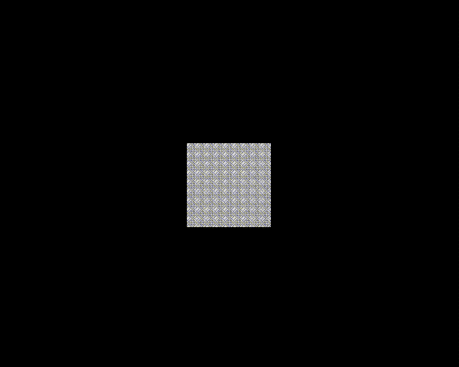

# Material Point Method Learning&Implementation in Unity (2D)

|            Fluid             |              Neo-Hookean               |
| :--------------------------: | :------------------------------------: |
|  |  |

## Reference

[The material point method for simulating continuum materials](https://dl.acm.org/doi/10.1145/2897826.2927348)

[A Moving Least Squares Material Point Method with Displacement Discontinuity and Two-Way Rigid Body Coupling](https://yuanming.taichi.graphics/publication/2018-mlsmpm/)

[mpm_guide](https://nialltl.neocities.org/articles/mpm_guide.html)

